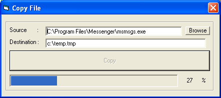



## Copy file byte by byte \(Updated\)

### Description

The program shows you how to copy files byte by byte. Everytime, it reads 4 kbs from the source file and write them in the destination file until it reads all bytes in the srouce file. There is a bar that shows the copying progress, and there is a label that shows the copying percentage. In the new update, you can use the browse button to find the source file you want to copy. I hope you will find the code useful .
 
### More Info
 

             |
---                |---
**Submitted On**   |2003-09-06 21:14:20
**By**             |[Nabhan Ahmed](https://github.com/Planet-Source-Code/PSCIndex/blob/master/ByAuthor/nabhan-ahmed.md)
**Level**          |Beginner
**User Rating**    |4.8 (58 globes from 12 users)
**Compatibility**  |VB 4\.0 \(32\-bit\), VB 5\.0, VB 6\.0
**Category**       |[Files/ File Controls/ Input/ Output](https://github.com/Planet-Source-Code/PSCIndex/blob/master/ByCategory/files-file-controls-input-output__1-3.md)
**World**          |[Visual Basic](https://github.com/Planet-Source-Code/PSCIndex/blob/master/ByWorld/visual-basic.md)
**Archive File**   |[Copy\_files164232962003\.zip](https://github.com/Planet-Source-Code/nabhan-ahmed-copy-file-byte-by-byte-updated__1-48319/archive/master.zip)

